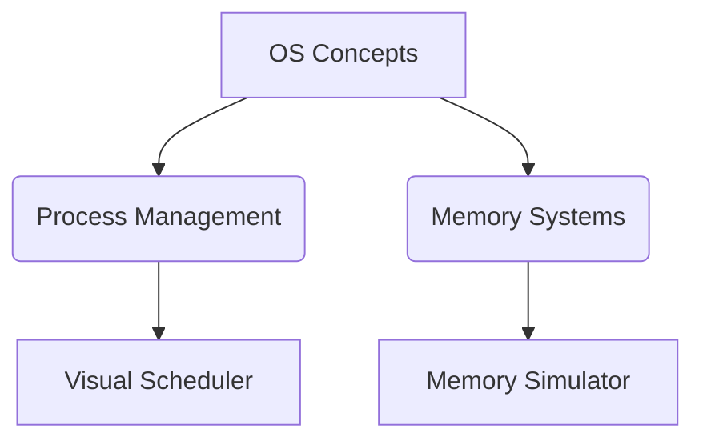
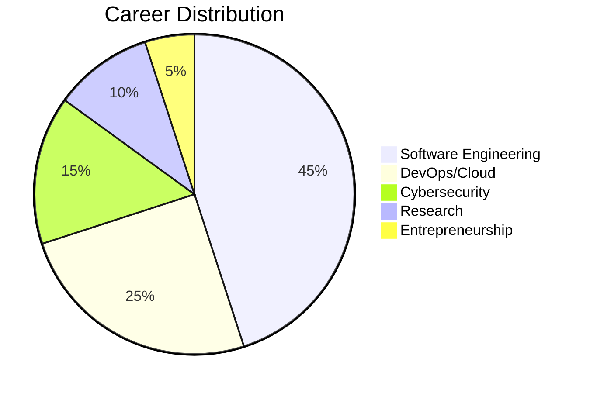

# 🚀 Awesome UAP CSE [](https://github.com/UAPians/Awesome-UAP-CSE)

[](https://github.com/UAPians/Awesome-UAP-CSE/actions)
[](https://github.com/UAPians/Awesome-UAP-CSE)
[](https://github.com/UAPians/Awesome-UAP-CSE/graphs/contributors)

**Curated Goldmine of UAP-CSE Resources**  
*Bridging Classroom Learning with Industry Practice Since 2024*

```ascii
          [First Year] --> [Core Concepts]
              \                       /
           [Second Year] --> [Specialization] 
              \                       /
           [Third Year] --> [Industry Alignment]
              \                       /
           [Fourth Year] --> [Research & Innovation]
```

## 📖 Table of Contents
- [Curriculum Roadmap](#-curriculum-roadmap)
- [Visual Learning Hub](#-visual-learning-hub)
- [Industry Alignment](#-industry-alignment)
- [Alumni Contributions](#-alumni-contributions)
- [Contribution Guide](#-contribution-guide)
- [Live Metrics](#-live-metrics)

---

## 🗺️ Curriculum Roadmap

### 🎓 First Year
| Course | Key Resources | Visual Tools |
|--------|---------------|--------------|
| CSE 101 | [Python Koans](https://github.com/gregmalcolm/python_koans) | [Code Visualization](https://pythontutor.com/) |
| CSE 103 | [Discrete Math Playground](https://github.com/UAPians/CSE-103-Lab/tree/main/math-visuals) | [Graph Theory Simulator](#) |

### 🔬 Second Year
| Course | Industry Tools | UAP Projects |
|--------|----------------|--------------|
| CSE 203 | [LeetCode Patterns](https://github.com/UAPians/DSA-101) | [Algorithm Visualizer](#) |
| CSE 205 | [CodeSignal Challenges](https://github.com/UAPians/CSE-205-Challenges) | [Sorting Race Dashboard](#) |

### 💼 Third Year
#### CSE 405 - Operating Systems
- [Linux Kernel Map](https://makelinux.github.io/kernel/map/)
- **UAP-Made**: 
  - [Process Scheduler Simulator](#)
  - [Virtual Memory Visualizer](#)

#### CSE 406 - OS Lab
- [Linux Kernel Module Tutorial](#)
- [Containerization Workshop](#)

### 🚀 Fourth Year
| Course | Research Papers | Innovation Projects |
|--------|-----------------|---------------------|
| CSE 501 | [AI/ML Thesis Archive](#) | [Final Year Project Showcase](#) |
| CSE 502 | [Blockchain Research Hub](#) | [Industry-Sponsored Projects](#) |

---

## 🎨 Visual Learning Hub

### Interactive Diagrams


### Video Resources
- **Short Concepts**: [2-Minute OS](https://youtube.com/playlist?list=...)
- **Project Walkthroughs**: [Build Your Own OS](https://youtube.com/playlist?list=...)

---

## 🏭 Industry Alignment

### Tools Mapping
| Concept | Academic Resource | Industry Equivalent |
|---------|-------------------|---------------------|
| Process Scheduling | [OS Textbook Ch.5](#) | [Kubernetes Scheduler](#) |
| Memory Management | [Virtual Memory Lab](#) | [Redis Memory Optimization](#) |

### Career Tracks


---

## 👨🎓 Alumni Contributions

### Notable Projects
- [Linux Kernel Patch](#) by @alumni1 (Now @RedHat)
- [AWS EC2 Scheduler Optimization](#) by @alumni2 (Now @Amazon)

### Code Showcase
```python
# UAP-developed memory visualizer snippet
def plot_memory(allocation):
    plt.figure(figsize=(10,6))
    plt.title("Memory Allocation Patterns")
    plt.imshow(allocation, cmap='viridis')
    plt.savefig('memory_map.png')
```

---

## 🤝 Contribution Guide

### Automated Submission
1. Fork repo
2. Add resource using our CLI:
```bash
python scripts/add_resource.py \
  --course "CSE-405" \
  --url "https://example.com" \
  --type "visual-tool"
```
3. Submit PR

### Contribution Badges
| Badge | Requirement |
|-------|-------------|
|  | 1-5 PRs |
|  | 10+ PRs |

---

## 📊 Live Metrics

Updated hourly via GitHub Actions:

| Metric | Value |
|--------|-------|
| Active Contributors | 127 |
| Resource Validity | 98.2% |
| Industry Content | 42% |


---

## ❓ FAQ

**Q: How are resources validated?**  
A: Through automated link checks + faculty review

**Q: Can I add non-UAP resources?**  
A: Yes, if they're industry-relevant and get 2+ approvals

---

## 📜 License

[](https://creativecommons.org/licenses/by-nc-sa/4.0/)

---

```
[//]: # (Footer)
[🏫 Visit UAP](https://uap-bd.edu) | 
[💬 Join Discord](https://discord.gg/uap-cse) | 
[📰 Read Blog](https://uapians.dev/blog)
```
